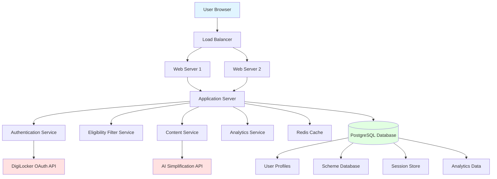
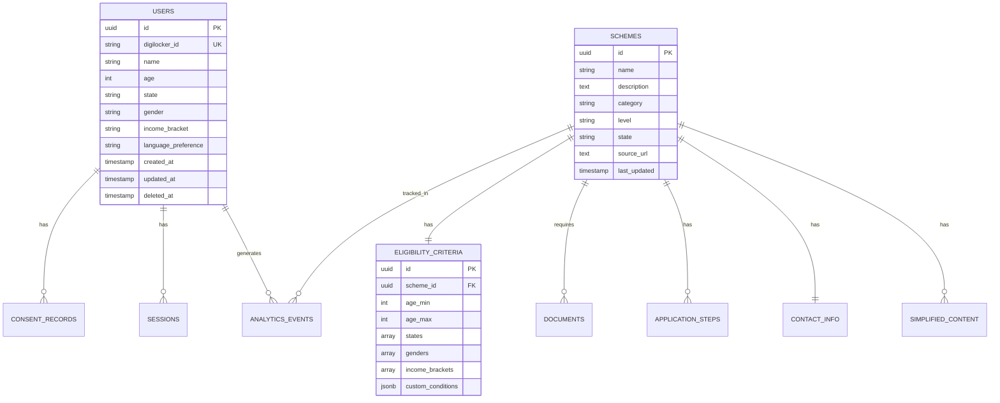
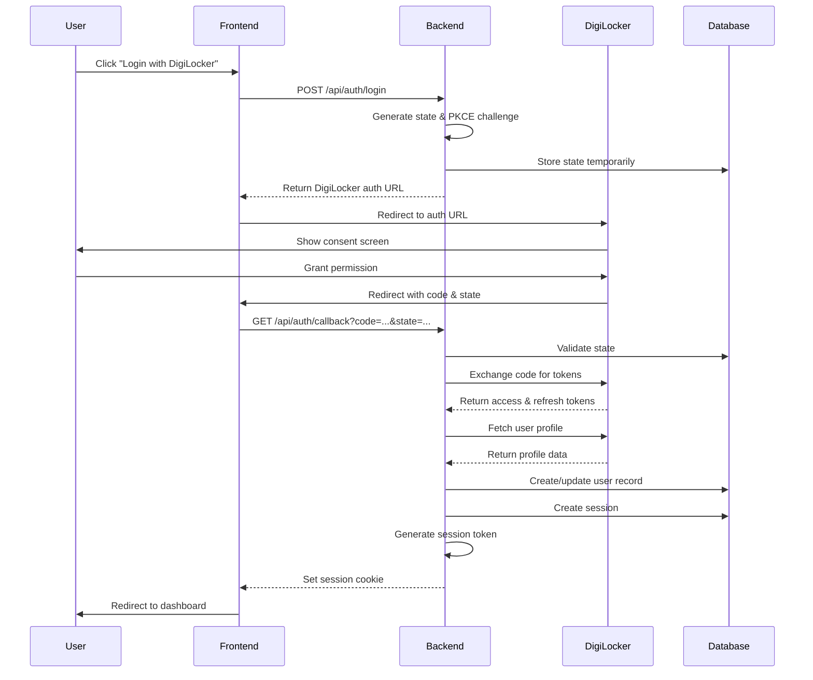
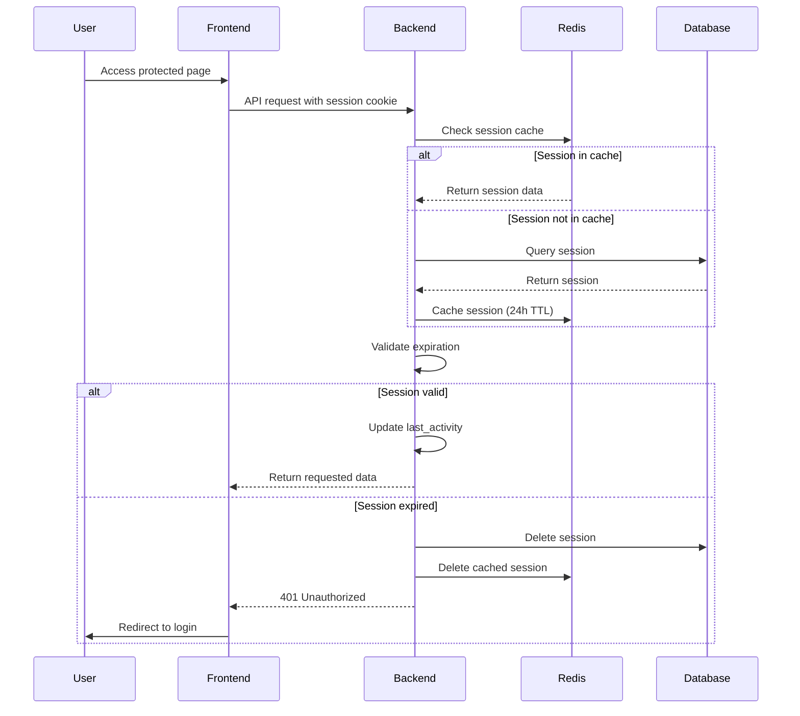
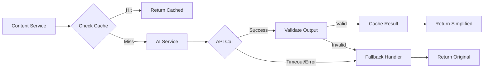
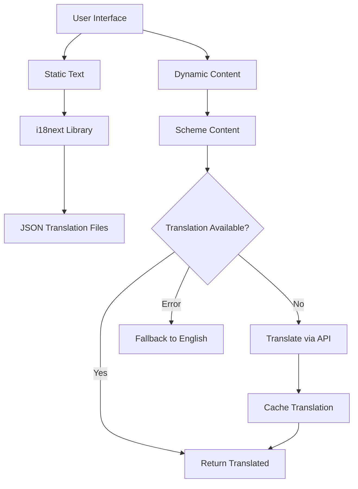
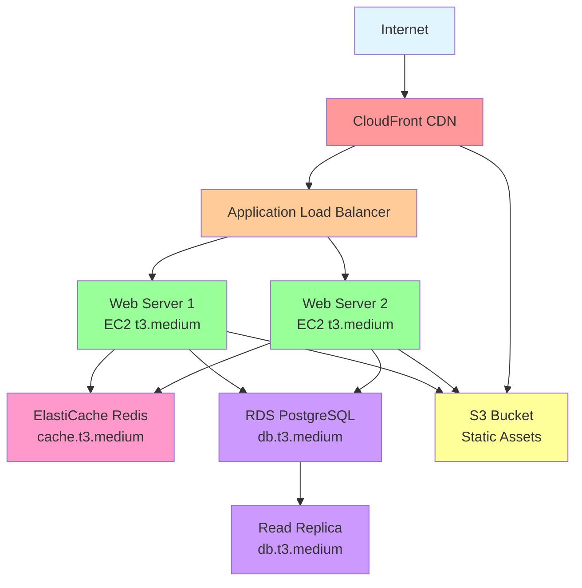
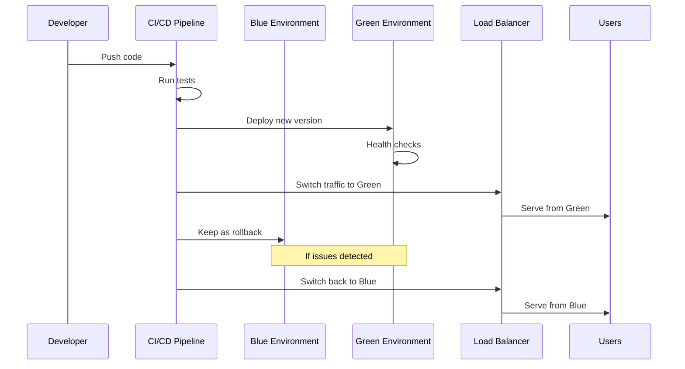

# Design Document: JanSaarthi AI Platform

## Overview

### Purpose

The JanSaarthi AI Platform is a mobile-first web application that democratizes access to government welfare schemes for underserved communities across India. The platform addresses the critical gap between available government benefits and citizen awareness by providing secure, personalized, and linguistically accessible scheme discovery and guidance.

### Design Philosophy

The design follows these core principles:

1. **Security First**: DigiLocker OAuth integration ensures verified identity without storing sensitive credentials
2. **Simplicity**: AI-powered content simplification makes complex government documentation accessible to users with limited education
3. **Inclusivity**: Multilingual support (Gujarati, Hindi, English) removes language barriers
4. **Mobile-First**: Optimized for smartphone access with responsive design and low-bandwidth performance
5. **Privacy by Design**: Minimal data collection with explicit consent and transparent data handling
6. **Scalability**: Cloud-native architecture supporting horizontal scaling for nationwide reach
7. **Reliability**: Graceful degradation when external services are unavailable

### High-Level Architecture

The platform follows a three-tier architecture:

**Presentation Layer**: Mobile-responsive web interface with multilingual support
**Application Layer**: Business logic for authentication, eligibility filtering, and content management
**Data Layer**: Relational database for user profiles, schemes, and analytics

**External Integrations**:
- DigiLocker OAuth API for authentication and identity verification
- AI/LLM API for content simplification (OpenAI GPT-4 or equivalent)
- Translation services for multilingual content


## Architecture

### System Architecture Diagram



### Component Architecture

The platform is organized into the following major components:

1. **Web Frontend**: React-based single-page application with responsive design
2. **API Gateway**: RESTful API layer handling all client-server communication
3. **Authentication Service**: DigiLocker OAuth integration and session management
4. **Eligibility Filter Service**: Rule-based engine matching user profiles to schemes
5. **Content Service**: AI-powered simplification and multilingual content delivery
6. **Analytics Service**: Usage tracking and performance monitoring
7. **Database Layer**: PostgreSQL for persistent storage with Redis for caching

### Technology Stack

**Frontend**:
- React 18 with TypeScript for type safety
- Tailwind CSS for responsive styling
- React Router for navigation
- Axios for API communication
- i18next for internationalization

**Backend**:
- Node.js with Express.js framework
- TypeScript for type safety
- Passport.js for OAuth integration
- Sequelize ORM for database access
- Redis for session storage and caching

**Database**:
- PostgreSQL 15 for relational data
- Redis 7 for caching and session management

**Infrastructure**:
- AWS EC2 for compute (or equivalent cloud provider)
- AWS RDS for managed PostgreSQL
- AWS ElastiCache for managed Redis
- AWS S3 for static asset storage
- AWS CloudFront for CDN
- AWS Application Load Balancer

**External Services**:
- DigiLocker OAuth API for authentication
- OpenAI GPT-4 API for content simplification
- Google Cloud Translation API for multilingual support


## Components and Interfaces

### 1. Authentication Service

**Responsibility**: Handle DigiLocker OAuth flow, session management, and user identity verification

**Key Operations**:

```typescript
interface AuthenticationService {
  // Initiate DigiLocker OAuth flow
  initiateLogin(): Promise<{ authUrl: string; state: string }>;
  
  // Handle OAuth callback and create session
  handleCallback(code: string, state: string): Promise<{ 
    sessionToken: string; 
    userId: string;
    expiresAt: Date;
  }>;
  
  // Validate session token
  validateSession(sessionToken: string): Promise<{
    valid: boolean;
    userId?: string;
    expiresAt?: Date;
  }>;
  
  // Refresh session
  refreshSession(sessionToken: string): Promise<{
    newToken: string;
    expiresAt: Date;
  }>;
  
  // Logout and invalidate session
  logout(sessionToken: string): Promise<void>;
  
  // Fetch user data from DigiLocker
  fetchDigiLockerProfile(accessToken: string): Promise<DigiLockerProfile>;
}

interface DigiLockerProfile {
  uniqueId: string;
  name: string;
  dateOfBirth: string;
  gender: 'M' | 'F' | 'O';
  address?: {
    state: string;
    district?: string;
  };
}
```

**Implementation Details**:
- OAuth 2.0 authorization code flow with PKCE
- Session tokens stored as HTTP-only, Secure cookies
- Session data cached in Redis with 24-hour TTL
- Automatic session refresh on user activity
- Rate limiting: 10 login attempts per IP per hour

**Error Handling**:
- Invalid OAuth state: Return 400 Bad Request
- DigiLocker API unavailable: Return 503 Service Unavailable with retry guidance
- Expired session: Return 401 Unauthorized with re-login prompt
- Invalid credentials: Return 401 Unauthorized


### 2. User Profile Service

**Responsibility**: Manage user demographic data, consent records, and profile updates

**Key Operations**:

```typescript
interface UserProfileService {
  // Create user profile from DigiLocker data
  createProfile(digiLockerId: string, profileData: ProfileData, consent: ConsentRecord): Promise<User>;
  
  // Get user profile
  getProfile(userId: string): Promise<User>;
  
  // Update profile data
  updateProfile(userId: string, updates: Partial<ProfileData>): Promise<User>;
  
  // Record consent
  recordConsent(userId: string, consentType: ConsentType, granted: boolean): Promise<ConsentRecord>;
  
  // Check consent status
  checkConsent(userId: string, consentType: ConsentType): Promise<boolean>;
  
  // Delete user account and all data
  deleteAccount(userId: string): Promise<void>;
  
  // Export user data
  exportUserData(userId: string): Promise<UserDataExport>;
}

interface ProfileData {
  name: string;
  age: number;
  state: string;
  gender: 'Male' | 'Female' | 'Other';
  incomeBracket: IncomeBracket;
}

enum IncomeBracket {
  BELOW_1_LAKH = 'BELOW_1_LAKH',
  ONE_TO_THREE_LAKH = '1_TO_3_LAKH',
  THREE_TO_FIVE_LAKH = '3_TO_5_LAKH',
  FIVE_TO_TEN_LAKH = '5_TO_10_LAKH',
  ABOVE_TEN_LAKH = 'ABOVE_10_LAKH'
}

enum ConsentType {
  DIGILOCKER_DATA_ACCESS = 'DIGILOCKER_DATA_ACCESS',
  ANALYTICS_TRACKING = 'ANALYTICS_TRACKING'
}

interface ConsentRecord {
  userId: string;
  consentType: ConsentType;
  granted: boolean;
  timestamp: Date;
  ipAddress: string;
}

interface User {
  id: string;
  digiLockerId: string;
  profile: ProfileData;
  consents: ConsentRecord[];
  languagePreference: 'en' | 'gu' | 'hi';
  createdAt: Date;
  updatedAt: Date;
}
```

**Implementation Details**:
- Profile data validated on input (age 1-120, valid state codes)
- Consent records immutable with audit trail
- Profile updates trigger scheme recommendation refresh
- Language preference stored in browser localStorage and database
- Soft delete for account deletion with 30-day retention before permanent deletion

**Data Validation**:
- Age: Integer between 1 and 120
- State: Must match ISO 3166-2:IN codes
- Income bracket: Must be one of defined enum values
- Name: Non-empty string, max 100 characters


### 3. Eligibility Filter Service

**Responsibility**: Match user profiles against scheme eligibility criteria to determine applicable schemes

**Key Operations**:

```typescript
interface EligibilityFilterService {
  // Get schemes eligible for user
  getEligibleSchemes(userId: string): Promise<Scheme[]>;
  
  // Get all schemes (regardless of eligibility)
  getAllSchemes(state?: string): Promise<Scheme[]>;
  
  // Check if user is eligible for specific scheme
  checkEligibility(userId: string, schemeId: string): Promise<EligibilityResult>;
  
  // Get eligibility explanation
  getEligibilityExplanation(userId: string, schemeId: string): Promise<string>;
}

interface EligibilityResult {
  eligible: boolean;
  matchedCriteria: string[];
  unmatchedCriteria: string[];
  reason: string;
}

interface EligibilityCriteria {
  ageMin?: number;
  ageMax?: number;
  states?: string[];
  gender?: ('Male' | 'Female' | 'Other')[];
  incomeBrackets?: IncomeBracket[];
  customConditions?: CustomCondition[];
}

interface CustomCondition {
  field: string;
  operator: 'equals' | 'contains' | 'greaterThan' | 'lessThan';
  value: any;
}

interface Scheme {
  id: string;
  name: string;
  description: string;
  category: SchemeCategory;
  level: 'CENTRAL' | 'STATE';
  state?: string;
  eligibility: EligibilityCriteria;
  benefits: string[];
  requiredDocuments: Document[];
  applicationProcess: ApplicationStep[];
  contactInfo: ContactInfo;
  sourceUrl: string;
  lastUpdated: Date;
}

enum SchemeCategory {
  AGRICULTURE = 'AGRICULTURE',
  EDUCATION = 'EDUCATION',
  HEALTHCARE = 'HEALTHCARE',
  HOUSING = 'HOUSING',
  EMPLOYMENT = 'EMPLOYMENT',
  SOCIAL_WELFARE = 'SOCIAL_WELFARE',
  FINANCIAL = 'FINANCIAL',
  PENSION = 'PENSION'
}
```

**Filtering Algorithm**:

```typescript
function filterEligibleSchemes(userProfile: ProfileData, schemes: Scheme[]): Scheme[] {
  return schemes.filter(scheme => {
    const criteria = scheme.eligibility;
    
    // Check age range
    if (criteria.ageMin && userProfile.age < criteria.ageMin) return false;
    if (criteria.ageMax && userProfile.age > criteria.ageMax) return false;
    
    // Check state (central schemes apply to all states)
    if (scheme.level === 'STATE' && criteria.states) {
      if (!criteria.states.includes(userProfile.state)) return false;
    }
    
    // Check gender
    if (criteria.gender && !criteria.gender.includes(userProfile.gender)) return false;
    
    // Check income bracket
    if (criteria.incomeBrackets && !criteria.incomeBrackets.includes(userProfile.incomeBracket)) {
      return false;
    }
    
    // Check custom conditions
    if (criteria.customConditions) {
      for (const condition of criteria.customConditions) {
        if (!evaluateCustomCondition(userProfile, condition)) return false;
      }
    }
    
    return true;
  });
}
```

**Implementation Details**:
- Eligibility evaluation runs in-memory for performance (<500ms)
- Results cached per user profile with 1-hour TTL
- Cache invalidated on profile updates
- Schemes pre-loaded into memory on application startup
- Supports complex eligibility rules through custom conditions


### 4. Content Service

**Responsibility**: Deliver scheme content with AI-powered simplification and multilingual support

**Key Operations**:

```typescript
interface ContentService {
  // Get scheme details with simplified content
  getSchemeContent(schemeId: string, language: Language, simplify: boolean): Promise<SchemeContent>;
  
  // Simplify text using AI
  simplifyText(text: string, language: Language): Promise<SimplifiedText>;
  
  // Translate content
  translateContent(text: string, targetLanguage: Language): Promise<string>;
  
  // Get cached simplified content
  getCachedSimplification(schemeId: string, field: string, language: Language): Promise<string | null>;
  
  // Pre-simplify all scheme content (batch operation)
  batchSimplifySchemes(schemeIds: string[]): Promise<void>;
}

type Language = 'en' | 'gu' | 'hi';

interface SimplifiedText {
  original: string;
  simplified: string;
  language: Language;
  readabilityScore: number;
  processingTime: number;
  cached: boolean;
}

interface SchemeContent {
  scheme: Scheme;
  simplifiedDescription?: string;
  simplifiedEligibility?: string;
  simplifiedBenefits?: string[];
  simplifiedApplicationSteps?: string[];
  language: Language;
}
```

**AI Simplification Strategy**:

```typescript
// Prompt template for GPT-4
const SIMPLIFICATION_PROMPT = `
You are helping Indian citizens understand government schemes. 
Simplify the following text to be understandable by someone with 8th grade education.

Requirements:
- Use simple, everyday words
- Keep sentences short (max 15 words)
- Maintain 100% factual accuracy
- Do not add or remove information
- Use active voice
- Avoid technical jargon
- If technical terms are necessary, explain them simply

Original text:
{text}

Simplified text in {language}:
`;

async function simplifyWithAI(text: string, language: Language): Promise<string> {
  const prompt = SIMPLIFICATION_PROMPT
    .replace('{text}', text)
    .replace('{language}', language === 'en' ? 'English' : language === 'gu' ? 'Gujarati' : 'Hindi');
  
  try {
    const response = await openai.chat.completions.create({
      model: 'gpt-4',
      messages: [{ role: 'user', content: prompt }],
      temperature: 0.3, // Low temperature for consistency
      max_tokens: 500,
      timeout: 3000 // 3 second timeout
    });
    
    return response.choices[0].message.content;
  } catch (error) {
    // Fallback to original text on error
    throw new SimplificationError('AI simplification failed', error);
  }
}
```

**Caching Strategy**:
- Simplified content cached for 7 days in Redis
- Cache key format: `simplified:{schemeId}:{field}:{language}`
- Pre-simplify all scheme content during data ingestion
- Lazy simplification for user-requested content not in cache
- Cache hit rate target: >90%

**Translation Strategy**:
- Interface text: Pre-translated and stored in JSON files
- Scheme content: Translated on-demand with caching
- Use Google Cloud Translation API for dynamic content
- Fallback to English if translation unavailable


### 5. Analytics Service

**Responsibility**: Track platform usage, performance metrics, and user behavior (without PII)

**Key Operations**:

```typescript
interface AnalyticsService {
  // Track scheme view
  trackSchemeView(schemeId: string, userId: string, language: Language): Promise<void>;
  
  // Track user action
  trackAction(action: UserAction, metadata: Record<string, any>): Promise<void>;
  
  // Get scheme view statistics
  getSchemeStats(schemeId: string, dateRange: DateRange): Promise<SchemeStats>;
  
  // Get platform metrics
  getPlatformMetrics(dateRange: DateRange): Promise<PlatformMetrics>;
  
  // Get language distribution
  getLanguageDistribution(): Promise<LanguageStats>;
}

enum UserAction {
  LOGIN = 'LOGIN',
  LOGOUT = 'LOGOUT',
  PROFILE_UPDATE = 'PROFILE_UPDATE',
  SCHEME_VIEW = 'SCHEME_VIEW',
  SCHEME_FILTER = 'SCHEME_FILTER',
  LANGUAGE_CHANGE = 'LANGUAGE_CHANGE',
  CONSENT_GRANT = 'CONSENT_GRANT',
  CONSENT_REVOKE = 'CONSENT_REVOKE'
}

interface SchemeStats {
  schemeId: string;
  totalViews: number;
  uniqueUsers: number;
  viewsByLanguage: Record<Language, number>;
  averageTimeOnPage: number;
}

interface PlatformMetrics {
  totalUsers: number;
  activeUsers: number;
  totalSchemeViews: number;
  averageSessionDuration: number;
  loginSuccessRate: number;
  aiSimplificationSuccessRate: number;
  averageApiResponseTime: number;
  errorRate: number;
}

interface LanguageStats {
  en: number;
  gu: number;
  hi: number;
}
```

**Implementation Details**:
- Events logged asynchronously to avoid blocking user requests
- No PII stored in analytics (use hashed user IDs)
- Daily aggregation jobs for performance metrics
- 90-day retention for raw event data
- Real-time dashboards for monitoring
- Alerts for anomalies (error rate >1%, response time >2s)

**Privacy Considerations**:
- User IDs hashed before storage
- IP addresses not logged
- No tracking of specific user journeys
- Aggregate statistics only
- Compliance with DPDPA 2023


### 6. API Gateway

**Responsibility**: Expose RESTful API endpoints for frontend communication

**API Endpoints**:

```
Authentication:
POST   /api/auth/login              - Initiate DigiLocker OAuth
GET    /api/auth/callback           - Handle OAuth callback
POST   /api/auth/logout             - Logout user
GET    /api/auth/session            - Validate session

User Profile:
GET    /api/profile                 - Get user profile
PUT    /api/profile                 - Update user profile
DELETE /api/profile                 - Delete account
GET    /api/profile/export          - Export user data
POST   /api/profile/consent         - Record consent

Schemes:
GET    /api/schemes                 - Get eligible schemes (query: ?all=true for all schemes)
GET    /api/schemes/:id             - Get scheme details
GET    /api/schemes/search          - Search schemes (query: ?q=keyword&category=HEALTH)

Content:
GET    /api/content/simplify        - Simplify text (query: ?text=...&lang=en)
GET    /api/content/translate       - Translate text (query: ?text=...&target=gu)

Analytics:
POST   /api/analytics/track         - Track user action
GET    /api/analytics/schemes/:id   - Get scheme statistics (admin only)
GET    /api/analytics/platform      - Get platform metrics (admin only)

Health:
GET    /api/health                  - Health check
GET    /api/health/digilocker       - DigiLocker API status
GET    /api/health/ai               - AI service status
```

**Request/Response Format**:

```typescript
// Standard success response
interface ApiResponse<T> {
  success: true;
  data: T;
  timestamp: string;
}

// Standard error response
interface ApiError {
  success: false;
  error: {
    code: string;
    message: string;
    details?: any;
  };
  timestamp: string;
}

// Example: GET /api/schemes/:id
interface GetSchemeResponse {
  success: true;
  data: {
    scheme: Scheme;
    eligible: boolean;
    eligibilityReason?: string;
    simplified: boolean;
    language: Language;
  };
  timestamp: string;
}
```

**Authentication**:
- Session token passed via HTTP-only cookie
- CSRF token in custom header for state-changing operations
- Rate limiting per endpoint (100 req/min per user)

**Error Codes**:
- `AUTH_REQUIRED`: 401 - Authentication required
- `FORBIDDEN`: 403 - Insufficient permissions
- `NOT_FOUND`: 404 - Resource not found
- `VALIDATION_ERROR`: 400 - Invalid input
- `RATE_LIMIT_EXCEEDED`: 429 - Too many requests
- `SERVICE_UNAVAILABLE`: 503 - External service down
- `INTERNAL_ERROR`: 500 - Server error


## Data Models

### Database Schema

**Users Table**:
```sql
CREATE TABLE users (
  id UUID PRIMARY KEY DEFAULT gen_random_uuid(),
  digilocker_id VARCHAR(255) UNIQUE NOT NULL,
  name VARCHAR(100) NOT NULL,
  age INTEGER NOT NULL CHECK (age >= 1 AND age <= 120),
  state VARCHAR(2) NOT NULL, -- ISO 3166-2:IN code
  gender VARCHAR(10) NOT NULL CHECK (gender IN ('Male', 'Female', 'Other')),
  income_bracket VARCHAR(50) NOT NULL,
  language_preference VARCHAR(2) DEFAULT 'en',
  created_at TIMESTAMP DEFAULT CURRENT_TIMESTAMP,
  updated_at TIMESTAMP DEFAULT CURRENT_TIMESTAMP,
  deleted_at TIMESTAMP NULL -- Soft delete
);

CREATE INDEX idx_users_digilocker ON users(digilocker_id);
CREATE INDEX idx_users_state ON users(state);
CREATE INDEX idx_users_deleted ON users(deleted_at) WHERE deleted_at IS NULL;
```

**Consent Records Table**:
```sql
CREATE TABLE consent_records (
  id UUID PRIMARY KEY DEFAULT gen_random_uuid(),
  user_id UUID NOT NULL REFERENCES users(id) ON DELETE CASCADE,
  consent_type VARCHAR(50) NOT NULL,
  granted BOOLEAN NOT NULL,
  timestamp TIMESTAMP DEFAULT CURRENT_TIMESTAMP,
  ip_address VARCHAR(45), -- IPv6 compatible
  user_agent TEXT
);

CREATE INDEX idx_consent_user ON consent_records(user_id);
CREATE INDEX idx_consent_type ON consent_records(consent_type);
```

**Sessions Table**:
```sql
CREATE TABLE sessions (
  id UUID PRIMARY KEY DEFAULT gen_random_uuid(),
  user_id UUID NOT NULL REFERENCES users(id) ON DELETE CASCADE,
  session_token VARCHAR(255) UNIQUE NOT NULL,
  oauth_access_token TEXT, -- Encrypted
  oauth_refresh_token TEXT, -- Encrypted
  expires_at TIMESTAMP NOT NULL,
  created_at TIMESTAMP DEFAULT CURRENT_TIMESTAMP,
  last_activity TIMESTAMP DEFAULT CURRENT_TIMESTAMP
);

CREATE INDEX idx_sessions_token ON sessions(session_token);
CREATE INDEX idx_sessions_user ON sessions(user_id);
CREATE INDEX idx_sessions_expires ON sessions(expires_at);
```

**Schemes Table**:
```sql
CREATE TABLE schemes (
  id UUID PRIMARY KEY DEFAULT gen_random_uuid(),
  name VARCHAR(255) NOT NULL,
  description TEXT NOT NULL,
  category VARCHAR(50) NOT NULL,
  level VARCHAR(10) NOT NULL CHECK (level IN ('CENTRAL', 'STATE')),
  state VARCHAR(2), -- NULL for central schemes
  source_url TEXT,
  last_updated TIMESTAMP DEFAULT CURRENT_TIMESTAMP,
  created_at TIMESTAMP DEFAULT CURRENT_TIMESTAMP
);

CREATE INDEX idx_schemes_category ON schemes(category);
CREATE INDEX idx_schemes_level ON schemes(level);
CREATE INDEX idx_schemes_state ON schemes(state);
```

**Eligibility Criteria Table**:
```sql
CREATE TABLE eligibility_criteria (
  id UUID PRIMARY KEY DEFAULT gen_random_uuid(),
  scheme_id UUID NOT NULL REFERENCES schemes(id) ON DELETE CASCADE,
  age_min INTEGER,
  age_max INTEGER,
  states TEXT[], -- Array of state codes
  genders TEXT[], -- Array of gender values
  income_brackets TEXT[], -- Array of income bracket values
  custom_conditions JSONB -- Flexible conditions
);

CREATE INDEX idx_eligibility_scheme ON eligibility_criteria(scheme_id);
```

**Documents Table**:
```sql
CREATE TABLE documents (
  id UUID PRIMARY KEY DEFAULT gen_random_uuid(),
  scheme_id UUID NOT NULL REFERENCES schemes(id) ON DELETE CASCADE,
  name VARCHAR(255) NOT NULL,
  description TEXT,
  mandatory BOOLEAN DEFAULT true,
  available_in_digilocker BOOLEAN DEFAULT false,
  how_to_obtain TEXT
);

CREATE INDEX idx_documents_scheme ON documents(scheme_id);
```

**Application Steps Table**:
```sql
CREATE TABLE application_steps (
  id UUID PRIMARY KEY DEFAULT gen_random_uuid(),
  scheme_id UUID NOT NULL REFERENCES schemes(id) ON DELETE CASCADE,
  step_number INTEGER NOT NULL,
  description TEXT NOT NULL,
  estimated_time_minutes INTEGER,
  portal_url TEXT
);

CREATE INDEX idx_steps_scheme ON application_steps(scheme_id);
```

**Contact Information Table**:
```sql
CREATE TABLE contact_info (
  id UUID PRIMARY KEY DEFAULT gen_random_uuid(),
  scheme_id UUID NOT NULL REFERENCES schemes(id) ON DELETE CASCADE,
  helpline_number VARCHAR(20),
  email VARCHAR(255),
  office_address TEXT,
  visiting_hours VARCHAR(100)
);

CREATE INDEX idx_contact_scheme ON contact_info(scheme_id);
```

**Simplified Content Cache Table**:
```sql
CREATE TABLE simplified_content (
  id UUID PRIMARY KEY DEFAULT gen_random_uuid(),
  scheme_id UUID NOT NULL REFERENCES schemes(id) ON DELETE CASCADE,
  field_name VARCHAR(50) NOT NULL, -- 'description', 'eligibility', etc.
  language VARCHAR(2) NOT NULL,
  original_text TEXT NOT NULL,
  simplified_text TEXT NOT NULL,
  readability_score DECIMAL(5,2),
  created_at TIMESTAMP DEFAULT CURRENT_TIMESTAMP,
  expires_at TIMESTAMP NOT NULL -- 7 days from creation
);

CREATE INDEX idx_simplified_lookup ON simplified_content(scheme_id, field_name, language);
CREATE INDEX idx_simplified_expires ON simplified_content(expires_at);
```

**Analytics Events Table**:
```sql
CREATE TABLE analytics_events (
  id UUID PRIMARY KEY DEFAULT gen_random_uuid(),
  user_id_hash VARCHAR(64) NOT NULL, -- SHA-256 hash for privacy
  action VARCHAR(50) NOT NULL,
  scheme_id UUID REFERENCES schemes(id),
  language VARCHAR(2),
  metadata JSONB,
  timestamp TIMESTAMP DEFAULT CURRENT_TIMESTAMP
);

CREATE INDEX idx_analytics_action ON analytics_events(action);
CREATE INDEX idx_analytics_timestamp ON analytics_events(timestamp);
CREATE INDEX idx_analytics_scheme ON analytics_events(scheme_id);
```

**Aggregated Analytics Table**:
```sql
CREATE TABLE analytics_daily (
  id UUID PRIMARY KEY DEFAULT gen_random_uuid(),
  date DATE NOT NULL,
  metric_name VARCHAR(100) NOT NULL,
  metric_value DECIMAL(15,2) NOT NULL,
  dimensions JSONB, -- Additional grouping dimensions
  created_at TIMESTAMP DEFAULT CURRENT_TIMESTAMP
);

CREATE UNIQUE INDEX idx_analytics_daily_unique ON analytics_daily(date, metric_name, dimensions);
```


### Data Relationships



### Data Access Patterns

**High-Frequency Queries**:
1. Get eligible schemes for user (cached, 1-hour TTL)
2. Get scheme details by ID (cached, 24-hour TTL)
3. Validate session token (Redis cache)
4. Get simplified content (Redis cache, 7-day TTL)

**Medium-Frequency Queries**:
1. Update user profile
2. Track analytics event
3. Search schemes by keyword
4. Get scheme statistics

**Low-Frequency Queries**:
1. Create user account
2. Delete user account
3. Batch simplify schemes
4. Generate analytics reports

**Optimization Strategies**:
- Redis caching for hot data (sessions, eligible schemes, simplified content)
- Database connection pooling (min: 10, max: 50 connections)
- Read replicas for analytics queries
- Materialized views for aggregated analytics
- Batch inserts for analytics events (every 10 seconds)


## Authentication and Authorization Flow

### DigiLocker OAuth Flow



### Session Management Flow



### Authorization Levels

**Public Access** (No authentication required):
- Home page
- Language selection
- Privacy policy
- Terms of service

**Authenticated User Access**:
- View profile
- Update profile
- View eligible schemes
- View scheme details
- Track analytics (own actions)

**Admin Access** (Future enhancement):
- View all analytics
- Manage scheme database
- View system health metrics
- Manage user accounts

### Security Measures

**Session Security**:
- HTTP-only cookies (prevent XSS access)
- Secure flag (HTTPS only)
- SameSite=Strict (prevent CSRF)
- 24-hour expiration with activity-based refresh
- Single active session per user

**Token Security**:
- OAuth tokens encrypted at rest (AES-256)
- Tokens never exposed to frontend
- Automatic token refresh before expiration
- Immediate token deletion on logout

**API Security**:
- CSRF tokens for state-changing operations
- Rate limiting per user and IP
- Input validation and sanitization
- SQL injection prevention (parameterized queries)
- XSS prevention (output encoding)

**Data Security**:
- TLS 1.3 for all communications
- Database encryption at rest
- Sensitive fields encrypted (OAuth tokens)
- Audit logging for data access
- Regular security audits


## AI Integration Architecture

### AI Service Design

**Provider**: OpenAI GPT-4 (or equivalent LLM with multilingual support)

**Integration Pattern**: API-based with caching and fallback



### Simplification Pipeline

**Step 1: Pre-processing**
```typescript
function preprocessText(text: string): string {
  // Remove excessive whitespace
  text = text.replace(/\s+/g, ' ').trim();
  
  // Split into chunks if too long (max 1000 words)
  if (text.split(' ').length > 1000) {
    text = text.split(' ').slice(0, 1000).join(' ') + '...';
  }
  
  return text;
}
```

**Step 2: AI Simplification**
```typescript
async function callAISimplification(text: string, language: Language): Promise<string> {
  const systemPrompt = `You are an expert at simplifying government documents for Indian citizens with limited education. 
Your goal is to make complex text understandable while maintaining 100% factual accuracy.`;

  const userPrompt = `Simplify this government scheme text for someone with 8th grade education.
Use simple words, short sentences (max 15 words), and active voice.
Maintain all facts and numbers exactly as stated.
Output in ${language === 'en' ? 'English' : language === 'gu' ? 'Gujarati' : 'Hindi'}.

Text: ${text}

Simplified version:`;

  const response = await openai.chat.completions.create({
    model: 'gpt-4',
    messages: [
      { role: 'system', content: systemPrompt },
      { role: 'user', content: userPrompt }
    ],
    temperature: 0.3,
    max_tokens: 800,
    timeout: 3000
  });

  return response.choices[0].message.content.trim();
}
```

**Step 3: Post-processing & Validation**
```typescript
function validateSimplification(original: string, simplified: string): boolean {
  // Check length (simplified should be 50-150% of original)
  const lengthRatio = simplified.length / original.length;
  if (lengthRatio < 0.5 || lengthRatio > 1.5) return false;
  
  // Check for hallucination indicators
  if (simplified.includes('I cannot') || simplified.includes('I apologize')) return false;
  
  // Check readability (Flesch-Kincaid grade level)
  const readabilityScore = calculateReadability(simplified);
  if (readabilityScore > 8) return false; // Should be 8th grade or below
  
  return true;
}
```

**Step 4: Caching**
```typescript
async function cacheSimplification(
  schemeId: string, 
  field: string, 
  language: Language, 
  simplified: string
): Promise<void> {
  const cacheKey = `simplified:${schemeId}:${field}:${language}`;
  const expiresAt = new Date(Date.now() + 7 * 24 * 60 * 60 * 1000); // 7 days
  
  // Store in Redis
  await redis.setex(cacheKey, 7 * 24 * 60 * 60, simplified);
  
  // Store in database for persistence
  await db.simplifiedContent.create({
    schemeId,
    fieldName: field,
    language,
    simplifiedText: simplified,
    expiresAt
  });
}
```

### Error Handling & Fallback

**Fallback Strategy**:
1. **Primary**: AI simplification with 3-second timeout
2. **Fallback 1**: Return cached version if available (even if expired)
3. **Fallback 2**: Return original text with warning banner
4. **Fallback 3**: Return error message if original unavailable

**Error Types**:
- `TIMEOUT`: AI service took >3 seconds
- `RATE_LIMIT`: API rate limit exceeded
- `INVALID_RESPONSE`: AI returned invalid or unsafe content
- `SERVICE_UNAVAILABLE`: AI service is down

**Monitoring**:
- Track success rate (target: >95%)
- Track average response time (target: <2s)
- Track cache hit rate (target: >90%)
- Alert if success rate drops below 90%
- Alert if response time exceeds 3s for >5% of requests

### Cost Optimization

**Strategies**:
1. **Pre-simplification**: Simplify all scheme content during data ingestion
2. **Aggressive caching**: 7-day cache with high hit rate
3. **Batch processing**: Simplify multiple schemes in parallel during off-peak hours
4. **Token optimization**: Use concise prompts to minimize token usage
5. **Model selection**: Use GPT-4 for quality, consider GPT-3.5-turbo for cost reduction

**Cost Estimates** (based on GPT-4 pricing):
- Average scheme content: ~500 tokens input, ~400 tokens output
- Cost per simplification: ~$0.015 (input) + $0.012 (output) = $0.027
- With 90% cache hit rate: ~$0.003 per request
- Monthly budget: $500 supports ~16,600 unique simplifications
- Expected usage: ~5,000 unique simplifications/month (well within budget)


## Multilingual Support Implementation

### Language Architecture

**Supported Languages**:
- English (en) - Default
- Gujarati (gu) - Primary target
- Hindi (hi) - Primary target

**Translation Layers**:



### Static Text Translation

**Implementation**: i18next library with JSON translation files

**File Structure**:
```
/locales
  /en
    common.json
    schemes.json
    errors.json
  /gu
    common.json
    schemes.json
    errors.json
  /hi
    common.json
    schemes.json
    errors.json
```

**Example Translation File** (`common.json`):
```json
{
  "nav": {
    "home": "Home",
    "schemes": "Schemes",
    "profile": "Profile",
    "logout": "Logout"
  },
  "auth": {
    "loginButton": "Login with DigiLocker",
    "loginDescription": "Secure login using your DigiLocker account",
    "sessionExpired": "Your session has expired. Please login again."
  },
  "profile": {
    "title": "My Profile",
    "name": "Name",
    "age": "Age",
    "state": "State",
    "gender": "Gender",
    "incomeBracket": "Income Bracket",
    "updateButton": "Update Profile"
  },
  "schemes": {
    "eligibleSchemes": "Schemes You're Eligible For",
    "allSchemes": "All Schemes",
    "noSchemes": "No schemes found matching your profile",
    "viewDetails": "View Details",
    "requiredDocuments": "Required Documents",
    "applicationProcess": "How to Apply"
  }
}
```

**Usage in React**:
```typescript
import { useTranslation } from 'react-i18next';

function SchemeList() {
  const { t } = useTranslation();
  
  return (
    <div>
      <h1>{t('schemes.eligibleSchemes')}</h1>
      <button>{t('schemes.viewDetails')}</button>
    </div>
  );
}
```

### Dynamic Content Translation

**Strategy**: On-demand translation with caching

**Translation Service**:
```typescript
interface TranslationService {
  translate(text: string, targetLanguage: Language): Promise<string>;
  batchTranslate(texts: string[], targetLanguage: Language): Promise<string[]>;
}

class GoogleTranslationService implements TranslationService {
  private client: TranslateClient;
  private cache: RedisCache;
  
  async translate(text: string, targetLanguage: Language): Promise<string> {
    // Check cache first
    const cacheKey = `translate:${targetLanguage}:${hashText(text)}`;
    const cached = await this.cache.get(cacheKey);
    if (cached) return cached;
    
    // Translate via API
    const [translation] = await this.client.translate(text, targetLanguage);
    
    // Cache for 30 days
    await this.cache.setex(cacheKey, 30 * 24 * 60 * 60, translation);
    
    return translation;
  }
  
  async batchTranslate(texts: string[], targetLanguage: Language): Promise<string[]> {
    // Check cache for each text
    const results: string[] = [];
    const toTranslate: { index: number; text: string }[] = [];
    
    for (let i = 0; i < texts.length; i++) {
      const cacheKey = `translate:${targetLanguage}:${hashText(texts[i])}`;
      const cached = await this.cache.get(cacheKey);
      
      if (cached) {
        results[i] = cached;
      } else {
        toTranslate.push({ index: i, text: texts[i] });
      }
    }
    
    // Translate uncached texts in batch
    if (toTranslate.length > 0) {
      const translations = await this.client.translate(
        toTranslate.map(t => t.text),
        targetLanguage
      );
      
      // Cache and store results
      for (let i = 0; i < toTranslate.length; i++) {
        const { index, text } = toTranslate[i];
        const translation = translations[i][0];
        results[index] = translation;
        
        const cacheKey = `translate:${targetLanguage}:${hashText(text)}`;
        await this.cache.setex(cacheKey, 30 * 24 * 60 * 60, translation);
      }
    }
    
    return results;
  }
}
```

### Language Detection & Selection

**Detection Strategy**:
1. Check user's saved preference (database)
2. Check browser localStorage
3. Check browser Accept-Language header
4. Default to English

**Implementation**:
```typescript
function detectLanguage(req: Request, user?: User): Language {
  // Priority 1: User preference from database
  if (user?.languagePreference) {
    return user.languagePreference;
  }
  
  // Priority 2: Browser localStorage (passed in header)
  const storedLang = req.headers['x-language-preference'];
  if (storedLang && ['en', 'gu', 'hi'].includes(storedLang)) {
    return storedLang as Language;
  }
  
  // Priority 3: Browser Accept-Language header
  const acceptLang = req.headers['accept-language'];
  if (acceptLang) {
    if (acceptLang.includes('gu')) return 'gu';
    if (acceptLang.includes('hi')) return 'hi';
  }
  
  // Default: English
  return 'en';
}
```

**Language Switcher Component**:
```typescript
function LanguageSwitcher() {
  const { i18n } = useTranslation();
  const [language, setLanguage] = useState(i18n.language);
  
  const changeLanguage = async (lang: Language) => {
    // Update i18next
    await i18n.changeLanguage(lang);
    
    // Update localStorage
    localStorage.setItem('language', lang);
    
    // Update user preference in database
    if (user) {
      await api.updateProfile({ languagePreference: lang });
    }
    
    setLanguage(lang);
  };
  
  return (
    <select value={language} onChange={(e) => changeLanguage(e.target.value as Language)}>
      <option value="en">English</option>
      <option value="gu">ગુજરાતી</option>
      <option value="hi">हिन्दी</option>
    </select>
  );
}
```

### Right-to-Left (RTL) Support

While Gujarati and Hindi are left-to-right languages, the design should be prepared for future RTL language support:

```css
/* CSS for RTL support */
[dir="rtl"] {
  direction: rtl;
  text-align: right;
}

[dir="rtl"] .margin-left {
  margin-left: 0;
  margin-right: 1rem;
}
```

### Translation Quality Assurance

**Process**:
1. Professional translation for all static UI text
2. Native speaker review for critical content
3. User feedback mechanism for translation issues
4. Quarterly review of translation quality
5. A/B testing for alternative translations

**Quality Metrics**:
- Translation accuracy: >95% (human evaluation)
- User satisfaction with translations: >4.0/5.0
- Translation error reports: <1% of users


## Security Design

### Threat Model

**Assets to Protect**:
1. User personal data (name, age, state, gender, income)
2. DigiLocker OAuth tokens
3. Session tokens
4. Scheme database integrity
5. Platform availability

**Threat Actors**:
1. Malicious users attempting unauthorized access
2. Automated bots attempting scraping or abuse
3. External attackers attempting data breaches
4. Insider threats (mitigated through access controls)

**Attack Vectors**:
1. SQL Injection
2. Cross-Site Scripting (XSS)
3. Cross-Site Request Forgery (CSRF)
4. Session hijacking
5. Man-in-the-middle attacks
6. Brute force attacks
7. Denial of Service (DoS)

### Security Controls

**1. Input Validation & Sanitization**

```typescript
// Input validation middleware
function validateInput(schema: ValidationSchema) {
  return (req: Request, res: Response, next: NextFunction) => {
    const { error, value } = schema.validate(req.body);
    
    if (error) {
      return res.status(400).json({
        success: false,
        error: {
          code: 'VALIDATION_ERROR',
          message: error.details[0].message
        }
      });
    }
    
    req.body = value; // Use sanitized value
    next();
  };
}

// Example schema for profile update
const profileUpdateSchema = Joi.object({
  name: Joi.string().max(100).trim().required(),
  age: Joi.number().integer().min(1).max(120).required(),
  state: Joi.string().length(2).uppercase().required(),
  gender: Joi.string().valid('Male', 'Female', 'Other').required(),
  incomeBracket: Joi.string().valid(
    'BELOW_1_LAKH',
    '1_TO_3_LAKH',
    '3_TO_5_LAKH',
    '5_TO_10_LAKH',
    'ABOVE_10_LAKH'
  ).required()
});
```

**2. SQL Injection Prevention**

```typescript
// Always use parameterized queries
async function getUserById(userId: string): Promise<User | null> {
  // CORRECT: Parameterized query
  const result = await db.query(
    'SELECT * FROM users WHERE id = $1 AND deleted_at IS NULL',
    [userId]
  );
  
  // INCORRECT: String concatenation (vulnerable to SQL injection)
  // const result = await db.query(`SELECT * FROM users WHERE id = '${userId}'`);
  
  return result.rows[0] || null;
}

// Use ORM with built-in protection
const user = await User.findOne({
  where: { id: userId, deletedAt: null }
});
```

**3. XSS Prevention**

```typescript
// Output encoding for HTML context
function escapeHtml(text: string): string {
  const map: Record<string, string> = {
    '&': '&amp;',
    '<': '&lt;',
    '>': '&gt;',
    '"': '&quot;',
    "'": '&#x27;',
    '/': '&#x2F;'
  };
  return text.replace(/[&<>"'/]/g, (char) => map[char]);
}

// Content Security Policy headers
app.use((req, res, next) => {
  res.setHeader(
    'Content-Security-Policy',
    "default-src 'self'; " +
    "script-src 'self' 'unsafe-inline' https://apis.google.com; " +
    "style-src 'self' 'unsafe-inline'; " +
    "img-src 'self' data: https:; " +
    "font-src 'self' data:; " +
    "connect-src 'self' https://api.openai.com https://digilocker.gov.in"
  );
  next();
});
```

**4. CSRF Protection**

```typescript
// CSRF token generation
function generateCsrfToken(): string {
  return crypto.randomBytes(32).toString('hex');
}

// CSRF middleware
function csrfProtection(req: Request, res: Response, next: NextFunction) {
  if (['POST', 'PUT', 'DELETE', 'PATCH'].includes(req.method)) {
    const token = req.headers['x-csrf-token'];
    const sessionToken = req.cookies.sessionToken;
    
    if (!token || !validateCsrfToken(sessionToken, token)) {
      return res.status(403).json({
        success: false,
        error: {
          code: 'CSRF_TOKEN_INVALID',
          message: 'Invalid CSRF token'
        }
      });
    }
  }
  
  next();
}
```

**5. Rate Limiting**

```typescript
// Rate limiting configuration
const rateLimiters = {
  login: rateLimit({
    windowMs: 60 * 60 * 1000, // 1 hour
    max: 10, // 10 attempts per hour
    message: 'Too many login attempts, please try again later'
  }),
  
  api: rateLimit({
    windowMs: 60 * 1000, // 1 minute
    max: 100, // 100 requests per minute
    keyGenerator: (req) => req.user?.id || req.ip,
    message: 'Too many requests, please slow down'
  }),
  
  aiSimplification: rateLimit({
    windowMs: 60 * 1000, // 1 minute
    max: 10, // 10 simplifications per minute
    keyGenerator: (req) => req.user?.id || req.ip,
    message: 'Too many simplification requests'
  })
};

// Apply rate limiters
app.post('/api/auth/login', rateLimiters.login, authController.login);
app.use('/api', rateLimiters.api);
app.get('/api/content/simplify', rateLimiters.aiSimplification, contentController.simplify);
```

**6. Encryption**

```typescript
// Encrypt sensitive data at rest
class EncryptionService {
  private algorithm = 'aes-256-gcm';
  private key: Buffer;
  
  constructor(encryptionKey: string) {
    this.key = crypto.scryptSync(encryptionKey, 'salt', 32);
  }
  
  encrypt(text: string): string {
    const iv = crypto.randomBytes(16);
    const cipher = crypto.createCipheriv(this.algorithm, this.key, iv);
    
    let encrypted = cipher.update(text, 'utf8', 'hex');
    encrypted += cipher.final('hex');
    
    const authTag = cipher.getAuthTag();
    
    return `${iv.toString('hex')}:${authTag.toString('hex')}:${encrypted}`;
  }
  
  decrypt(encryptedText: string): string {
    const [ivHex, authTagHex, encrypted] = encryptedText.split(':');
    
    const iv = Buffer.from(ivHex, 'hex');
    const authTag = Buffer.from(authTagHex, 'hex');
    const decipher = crypto.createDecipheriv(this.algorithm, this.key, iv);
    
    decipher.setAuthTag(authTag);
    
    let decrypted = decipher.update(encrypted, 'hex', 'utf8');
    decrypted += decipher.final('utf8');
    
    return decrypted;
  }
}

// Usage for OAuth tokens
async function storeSession(userId: string, accessToken: string): Promise<string> {
  const encryptedToken = encryptionService.encrypt(accessToken);
  
  const session = await db.sessions.create({
    userId,
    sessionToken: generateSessionToken(),
    oauthAccessToken: encryptedToken,
    expiresAt: new Date(Date.now() + 24 * 60 * 60 * 1000)
  });
  
  return session.sessionToken;
}
```

**7. Secure Headers**

```typescript
// Security headers middleware
app.use(helmet({
  contentSecurityPolicy: {
    directives: {
      defaultSrc: ["'self'"],
      scriptSrc: ["'self'", "'unsafe-inline'", "https://apis.google.com"],
      styleSrc: ["'self'", "'unsafe-inline'"],
      imgSrc: ["'self'", "data:", "https:"],
      connectSrc: ["'self'", "https://api.openai.com", "https://digilocker.gov.in"]
    }
  },
  hsts: {
    maxAge: 31536000,
    includeSubDomains: true,
    preload: true
  },
  frameguard: { action: 'deny' },
  noSniff: true,
  xssFilter: true
}));
```

### Audit Logging

```typescript
interface AuditLog {
  id: string;
  userId: string;
  action: string;
  resource: string;
  resourceId?: string;
  ipAddress: string;
  userAgent: string;
  timestamp: Date;
  success: boolean;
  errorMessage?: string;
}

async function logAuditEvent(event: Omit<AuditLog, 'id' | 'timestamp'>): Promise<void> {
  await db.auditLogs.create({
    ...event,
    timestamp: new Date()
  });
}

// Usage
await logAuditEvent({
  userId: user.id,
  action: 'PROFILE_UPDATE',
  resource: 'USER_PROFILE',
  resourceId: user.id,
  ipAddress: req.ip,
  userAgent: req.headers['user-agent'],
  success: true
});
```

### Security Monitoring & Incident Response

**Monitoring**:
- Failed login attempts (alert if >100/hour)
- Rate limit violations (alert if >1000/hour)
- Database query errors (alert if >10/minute)
- Unusual data access patterns
- API error rates (alert if >5%)

**Incident Response Plan**:
1. **Detection**: Automated alerts via monitoring system
2. **Assessment**: Security team evaluates severity
3. **Containment**: Isolate affected systems, revoke compromised tokens
4. **Eradication**: Patch vulnerabilities, update security controls
5. **Recovery**: Restore services, verify integrity
6. **Post-Incident**: Document lessons learned, update procedures

**Security Contacts**:
- Security Officer: security@jansaarthi.gov.in
- Incident Response Team: incident@jansaarthi.gov.in
- Data Protection Officer: dpo@jansaarthi.gov.in


## Performance Optimization Strategies

### Frontend Optimization

**1. Code Splitting**
```typescript
// Lazy load routes
const Dashboard = lazy(() => import('./pages/Dashboard'));
const SchemeDetails = lazy(() => import('./pages/SchemeDetails'));
const Profile = lazy(() => import('./pages/Profile'));

function App() {
  return (
    <Suspense fallback={<LoadingSpinner />}>
      <Routes>
        <Route path="/" element={<Home />} />
        <Route path="/dashboard" element={<Dashboard />} />
        <Route path="/schemes/:id" element={<SchemeDetails />} />
        <Route path="/profile" element={<Profile />} />
      </Routes>
    </Suspense>
  );
}
```

**2. Image Optimization**
- Use WebP format with JPEG fallback
- Implement responsive images with srcset
- Lazy load images below the fold
- Compress images to <100KB
- Use CDN for static assets

**3. Bundle Optimization**
- Tree shaking to remove unused code
- Minification and compression (gzip/brotli)
- Target bundle size: <200KB initial load
- Use production builds with optimizations

**4. Caching Strategy**
```typescript
// Service Worker for offline caching (future enhancement)
const CACHE_NAME = 'jansaarthi-v1';
const urlsToCache = [
  '/',
  '/static/css/main.css',
  '/static/js/main.js',
  '/locales/en/common.json',
  '/locales/gu/common.json',
  '/locales/hi/common.json'
];

// Browser caching headers
app.use((req, res, next) => {
  if (req.url.startsWith('/static/')) {
    res.setHeader('Cache-Control', 'public, max-age=31536000, immutable');
  } else if (req.url.startsWith('/api/')) {
    res.setHeader('Cache-Control', 'no-cache, no-store, must-revalidate');
  }
  next();
});
```

### Backend Optimization

**1. Database Query Optimization**

```typescript
// Use indexes for frequent queries
CREATE INDEX idx_users_digilocker ON users(digilocker_id);
CREATE INDEX idx_schemes_category ON schemes(category);
CREATE INDEX idx_eligibility_scheme ON eligibility_criteria(scheme_id);

// Use connection pooling
const pool = new Pool({
  host: process.env.DB_HOST,
  database: process.env.DB_NAME,
  user: process.env.DB_USER,
  password: process.env.DB_PASSWORD,
  max: 50, // Maximum pool size
  min: 10, // Minimum pool size
  idleTimeoutMillis: 30000,
  connectionTimeoutMillis: 2000
});

// Use query result caching
async function getEligibleSchemes(userId: string): Promise<Scheme[]> {
  const cacheKey = `eligible_schemes:${userId}`;
  
  // Check cache
  const cached = await redis.get(cacheKey);
  if (cached) return JSON.parse(cached);
  
  // Query database
  const schemes = await db.query(/* ... */);
  
  // Cache for 1 hour
  await redis.setex(cacheKey, 3600, JSON.stringify(schemes));
  
  return schemes;
}
```

**2. Redis Caching Strategy**

```typescript
// Cache hierarchy
const CACHE_TTL = {
  SESSION: 24 * 60 * 60,           // 24 hours
  USER_PROFILE: 60 * 60,           // 1 hour
  ELIGIBLE_SCHEMES: 60 * 60,       // 1 hour
  SCHEME_DETAILS: 24 * 60 * 60,    // 24 hours
  SIMPLIFIED_CONTENT: 7 * 24 * 60 * 60, // 7 days
  TRANSLATIONS: 30 * 24 * 60 * 60  // 30 days
};

// Cache warming on startup
async function warmCache(): Promise<void> {
  console.log('Warming cache...');
  
  // Load all schemes into memory
  const schemes = await db.schemes.findAll();
  for (const scheme of schemes) {
    const cacheKey = `scheme:${scheme.id}`;
    await redis.setex(cacheKey, CACHE_TTL.SCHEME_DETAILS, JSON.stringify(scheme));
  }
  
  console.log(`Cached ${schemes.length} schemes`);
}
```

**3. API Response Optimization**

```typescript
// Compression middleware
app.use(compression({
  level: 6, // Compression level (0-9)
  threshold: 1024, // Only compress responses > 1KB
  filter: (req, res) => {
    if (req.headers['x-no-compression']) return false;
    return compression.filter(req, res);
  }
}));

// Pagination for large result sets
interface PaginationParams {
  page: number;
  limit: number;
}

async function getSchemesPaginated(params: PaginationParams): Promise<{
  schemes: Scheme[];
  total: number;
  page: number;
  totalPages: number;
}> {
  const { page = 1, limit = 20 } = params;
  const offset = (page - 1) * limit;
  
  const [schemes, total] = await Promise.all([
    db.schemes.findAll({ limit, offset }),
    db.schemes.count()
  ]);
  
  return {
    schemes,
    total,
    page,
    totalPages: Math.ceil(total / limit)
  };
}
```

**4. Async Processing**

```typescript
// Use job queue for heavy operations
import Bull from 'bull';

const simplificationQueue = new Bull('simplification', {
  redis: { host: 'localhost', port: 6379 }
});

// Producer: Add job to queue
async function queueSimplification(schemeId: string): Promise<void> {
  await simplificationQueue.add({
    schemeId,
    timestamp: Date.now()
  });
}

// Consumer: Process jobs
simplificationQueue.process(async (job) => {
  const { schemeId } = job.data;
  const scheme = await db.schemes.findById(schemeId);
  
  // Simplify all fields
  const simplified = await simplifySchemeContent(scheme);
  
  // Cache results
  await cacheSimplifiedContent(schemeId, simplified);
});
```

### Network Optimization

**1. CDN Configuration**
- Use CloudFront or equivalent CDN
- Cache static assets at edge locations
- Enable HTTP/2 for multiplexing
- Enable Brotli compression

**2. API Gateway Optimization**
- Request batching for multiple resources
- GraphQL for flexible data fetching (future enhancement)
- WebSocket for real-time updates (future enhancement)

**3. Mobile Optimization**
- Reduce payload sizes for mobile clients
- Implement adaptive loading based on network speed
- Use responsive images with appropriate sizes

### Performance Monitoring

```typescript
// Performance metrics middleware
app.use((req, res, next) => {
  const start = Date.now();
  
  res.on('finish', () => {
    const duration = Date.now() - start;
    
    // Log slow requests
    if (duration > 1000) {
      console.warn(`Slow request: ${req.method} ${req.path} took ${duration}ms`);
    }
    
    // Track metrics
    metrics.recordApiLatency(req.path, duration);
  });
  
  next();
});

// Performance targets
const PERFORMANCE_TARGETS = {
  HOME_PAGE_LOAD: 2000,        // 2 seconds on 4G
  API_RESPONSE_TIME: 500,      // 500ms average
  DATABASE_QUERY_TIME: 100,    // 100ms average
  AI_SIMPLIFICATION_TIME: 3000, // 3 seconds max
  CACHE_HIT_RATE: 0.90         // 90% cache hit rate
};
```

### Scalability Design

**Horizontal Scaling**:
- Stateless application servers (session in Redis)
- Load balancer distributes traffic across instances
- Auto-scaling based on CPU/memory metrics
- Database read replicas for read-heavy workloads

**Vertical Scaling**:
- Optimize database queries before scaling hardware
- Use appropriate instance sizes for workload
- Monitor resource utilization and adjust

**Database Scaling**:
- Read replicas for analytics queries
- Connection pooling to manage connections
- Partitioning for large tables (future)
- Caching layer to reduce database load


## Correctness Properties

### What are Correctness Properties?

A property is a characteristic or behavior that should hold true across all valid executions of a system—essentially, a formal statement about what the system should do. Properties serve as the bridge between human-readable specifications and machine-verifiable correctness guarantees.

Properties are tested using property-based testing, where the testing framework generates many random inputs to verify that the property holds universally, not just for specific examples.

### Property Reflection

After analyzing all 78 acceptance criteria, I identified several areas where properties can be consolidated:

**Consolidation Decisions**:
1. **Simplification properties (5.1, 5.2, 5.3)**: Combined into a single property about AI simplification behavior across all content types
2. **Data display properties (7.1, 7.2, 7.5, 8.1, 8.2, 8.4)**: Combined into properties about complete data rendering
3. **Session management properties (11.1, 11.3)**: Combined into a single property about session duration
4. **Analytics tracking properties (13.1, 13.2, 13.3, 13.4)**: Combined into a single property about event tracking
5. **Validation properties (3.3, 3.4)**: Combined into a single property about input validation

The following properties represent the unique, non-redundant correctness guarantees for the JanSaarthi AI platform:


### Authentication & Session Properties

**Property 1: OAuth Redirect Correctness**
*For any* user initiating login, clicking the DigiLocker login button should result in a redirect to the DigiLocker OAuth authorization URL with valid state and PKCE parameters.
**Validates: Requirements 1.2**

**Property 2: Session Creation from OAuth Token**
*For any* valid OAuth token received from DigiLocker, the system should create a session with expiration time exactly 24 hours from creation and return an HTTP-only secure cookie.
**Validates: Requirements 1.3, 1.4, 1.6**

**Property 3: Authentication Error Handling**
*For any* DigiLocker authorization failure, the system should return an error response in the user's selected language with a retry option, without creating a session.
**Validates: Requirements 1.5**

**Property 4: Session Duration and Extension**
*For any* active session, the expiration time should be exactly 24 hours from the last user activity, and user interactions should extend the session by 24 hours.
**Validates: Requirements 11.1, 11.3**

**Property 5: Session Uniqueness**
*For any* user account, creating a new session should invalidate all previous sessions for that user, ensuring only one active session exists.
**Validates: Requirements 11.5**

**Property 6: Logout Completeness**
*For any* logout action, the system should immediately delete the session from the database, clear the session cookie, and invalidate any cached session data.
**Validates: Requirements 11.4**

### Consent & Privacy Properties

**Property 7: First-Time User Consent Flow**
*For any* user completing DigiLocker authentication without an existing consent record, the system should display a consent screen before fetching any profile data.
**Validates: Requirements 2.1**

**Property 8: Consent Grant Flow**
*For any* user granting consent, the system should create a consent record with timestamp and IP address, then fetch profile data from DigiLocker API.
**Validates: Requirements 2.3, 3.1**

**Property 9: Consent Denial Flow**
*For any* user denying consent, the system should not fetch DigiLocker data and should present a manual profile entry form instead.
**Validates: Requirements 2.4**

**Property 10: Consent Revocation and Data Deletion**
*For any* consent revocation, the system should delete all DigiLocker-fetched data within 24 hours and create an audit log entry of the deletion.
**Validates: Requirements 2.6**

### Profile Management Properties

**Property 11: Profile Input Validation**
*For any* profile data input, the system should accept age values in range [1, 120] and valid Indian state codes, and reject all other values with appropriate error messages.
**Validates: Requirements 3.3, 3.4**

**Property 12: Profile Update Triggers Cache Invalidation**
*For any* profile update, the system should immediately invalidate the cached eligible schemes for that user and recalculate eligibility on next request.
**Validates: Requirements 3.7**

**Property 13: Incomplete Profile Handling**
*For any* user profile missing required fields (age, state, gender, or income bracket), the system should display a profile completion prompt and prevent access to scheme recommendations.
**Validates: Requirements 3.5**

### Eligibility Filtering Properties

**Property 14: Eligibility Filter Completeness**
*For any* user with a complete profile, the eligibility filter should evaluate every scheme in the database and return all schemes where all eligibility criteria are satisfied.
**Validates: Requirements 4.1, 4.2**

**Property 15: Eligibility Criteria Conjunction**
*For any* scheme with multiple eligibility criteria (age, state, gender, income), the scheme should be marked eligible only if ALL criteria match the user profile (AND logic, not OR).
**Validates: Requirements 4.3**

**Property 16: Eligibility Filter Correctness**
*For any* user profile and scheme, if the user's age is within the scheme's age range, the user's state matches the scheme's state list (or scheme is central), the user's gender matches the scheme's gender list, and the user's income bracket matches the scheme's income list, then the scheme should be marked as eligible.
**Validates: Requirements 4.2**

### AI Simplification Properties

**Property 17: AI Simplification Behavior**
*For any* scheme content (description, eligibility criteria, or benefits), the AI simplifier should produce simplified text that is shorter or similar length, uses simpler vocabulary, and maintains the same factual information.
**Validates: Requirements 5.1, 5.2, 5.3, 5.4**

**Property 18: Simplification Fallback**
*For any* AI simplification failure or timeout, the system should return the original unsimplified content with a warning banner, ensuring users always receive content.
**Validates: Requirements 5.5**

**Property 19: Simplification Performance**
*For any* large sample of simplification requests (n ≥ 100), at least 95% should complete within 3 seconds.
**Validates: Requirements 5.6**

**Property 20: Simplification Caching**
*For any* scheme content that has been simplified, requesting the same content again within 7 days should return the cached result without calling the AI API.
**Validates: Design requirement for cost optimization**

### Multilingual Support Properties

**Property 21: Language Detection**
*For any* first-time user with a browser Accept-Language header containing 'gu' or 'hi', the system should set the initial interface language to Gujarati or Hindi respectively.
**Validates: Requirements 6.2**

**Property 22: Language Switching**
*For any* language change action, all interface text, labels, and buttons should update to the selected language without requiring a page reload.
**Validates: Requirements 6.4**

**Property 23: Content Localization**
*For any* scheme content request, the system should return content in the user's selected language if available, or fall back to English with a notification banner if translation is unavailable.
**Validates: Requirements 6.5, 6.6**

**Property 24: Language Persistence**
*For any* language selection, the preference should be stored in browser localStorage and the user's database profile, and should be restored on the next session.
**Validates: Requirements 6.7**

### Content Display Properties

**Property 25: Scheme Detail Completeness**
*For any* scheme, the detail page should display all available fields: name, description, benefits, eligibility criteria, required documents, application steps, and contact information.
**Validates: Requirements 7.1, 7.2, 7.3, 7.4, 7.5**

**Property 26: Document Information Completeness**
*For any* document associated with a scheme, the system should display the document name, description, mandatory/optional badge, and guidance on where to obtain it.
**Validates: Requirements 8.1, 8.2, 8.3, 8.4**

**Property 27: DigiLocker Document Indicator**
*For any* document marked as available in DigiLocker, the UI should display a DigiLocker icon next to the document name.
**Validates: Requirements 8.5**

**Property 28: Application Step Formatting**
*For any* scheme, application steps should be displayed as a numbered list in sequential order with simplified text.
**Validates: Requirements 9.1, 9.2**

**Property 29: Portal Link Rendering**
*For any* scheme with a non-null portal URL, the application process section should include a clickable link to that URL.
**Validates: Requirements 9.3**

**Property 30: Long Content Accordion**
*For any* scheme with total content exceeding 800 words, the detail page should organize content into collapsible accordion sections.
**Validates: Requirements 7.6**

### Mobile Responsiveness Properties

**Property 31: Responsive Layout**
*For any* screen width in the range [320px, 1920px], the platform should render without horizontal scrollbars and all content should be accessible through vertical scrolling only.
**Validates: Requirements 10.1, 10.3**

**Property 32: Touch Target Size**
*For any* interactive element (button, link, input), the tap target size should be at least 44px × 44px for mobile accessibility.
**Validates: Requirements 10.2**

**Property 33: Mobile Performance**
*For any* page load on a simulated 3G connection, the home page should complete loading within 3 seconds.
**Validates: Requirements 10.4**

**Property 34: Image Optimization**
*For any* image served by the platform, it should be compressed, use modern formats (WebP with fallback), and have responsive sizes defined.
**Validates: Requirements 10.5**

### Error Handling Properties

**Property 35: Error Message Localization**
*For any* error that occurs, the error message should be displayed in the user's currently selected language.
**Validates: Requirements 12.1**

**Property 36: Actionable Error Messages**
*For any* common error type (network error, validation error, service unavailable), the error message should include specific guidance on how to resolve the issue.
**Validates: Requirements 12.2**

**Property 37: Service Unavailability Handling**
*For any* DigiLocker API failure, the system should display a service unavailability message with a retry button and not crash or hang.
**Validates: Requirements 12.3**

**Property 38: Error Logging Completeness**
*For any* error that occurs, a log entry should be created containing severity level, timestamp, error message, user ID (if available), and request context.
**Validates: Requirements 12.5**

### Analytics & Privacy Properties

**Property 39: Analytics Event Tracking**
*For any* user action (scheme view, login, profile update, language change), an analytics event should be recorded with action type, timestamp, and non-PII metadata.
**Validates: Requirements 13.1, 13.2, 13.3, 13.4**

**Property 40: Analytics Privacy**
*For any* analytics event, the stored data should not contain personally identifiable information (email, name, full address, phone number).
**Validates: Requirements 13.5**

**Property 41: Analytics Data Retention**
*For any* analytics event older than 90 days, it should be automatically deleted from the database.
**Validates: Requirements 13.6**

### Data Integrity Properties

**Property 42: Session Token Uniqueness**
*For any* two sessions created at different times, they should have different session tokens (no collisions).
**Validates: Design requirement for security**

**Property 43: Encryption Round-Trip**
*For any* sensitive data (OAuth tokens) encrypted and stored, decrypting the stored value should produce the original plaintext.
**Validates: Design requirement for encryption**

**Property 44: Database Transaction Consistency**
*For any* multi-step operation (e.g., create user + create consent record), either all database operations should succeed or all should be rolled back (no partial state).
**Validates: Design requirement for data integrity**


## Error Handling

### Error Classification

**Client Errors (4xx)**:
- `400 Bad Request`: Invalid input data, validation failures
- `401 Unauthorized`: Missing or invalid session token
- `403 Forbidden`: Valid session but insufficient permissions
- `404 Not Found`: Resource does not exist
- `429 Too Many Requests`: Rate limit exceeded

**Server Errors (5xx)**:
- `500 Internal Server Error`: Unexpected server error
- `502 Bad Gateway`: Upstream service error (DigiLocker, AI API)
- `503 Service Unavailable`: Service temporarily down
- `504 Gateway Timeout`: Upstream service timeout

### Error Response Format

```typescript
interface ErrorResponse {
  success: false;
  error: {
    code: string;
    message: string;
    details?: any;
    retryable: boolean;
    retryAfter?: number; // seconds
  };
  timestamp: string;
  requestId: string;
}

// Example error responses
const examples = {
  validationError: {
    success: false,
    error: {
      code: 'VALIDATION_ERROR',
      message: 'Age must be between 1 and 120',
      details: { field: 'age', value: 150, constraint: 'range' },
      retryable: false
    },
    timestamp: '2024-01-15T10:30:00Z',
    requestId: 'req_abc123'
  },
  
  serviceUnavailable: {
    success: false,
    error: {
      code: 'DIGILOCKER_UNAVAILABLE',
      message: 'DigiLocker service is temporarily unavailable. Please try again in a few minutes.',
      retryable: true,
      retryAfter: 60
    },
    timestamp: '2024-01-15T10:30:00Z',
    requestId: 'req_abc124'
  },
  
  rateLimitExceeded: {
    success: false,
    error: {
      code: 'RATE_LIMIT_EXCEEDED',
      message: 'Too many requests. Please wait before trying again.',
      retryable: true,
      retryAfter: 60
    },
    timestamp: '2024-01-15T10:30:00Z',
    requestId: 'req_abc125'
  }
};
```

### Error Handling Strategies

**1. Graceful Degradation**

```typescript
// AI Simplification with fallback
async function getSchemeContent(schemeId: string, language: Language): Promise<SchemeContent> {
  const scheme = await db.schemes.findById(schemeId);
  
  try {
    // Try to get simplified content
    const simplified = await contentService.simplifyText(scheme.description, language);
    return {
      ...scheme,
      description: simplified,
      simplified: true
    };
  } catch (error) {
    // Fallback to original content
    logger.warn('Simplification failed, using original content', { schemeId, error });
    return {
      ...scheme,
      description: scheme.description,
      simplified: false,
      warning: 'Content could not be simplified'
    };
  }
}
```

**2. Retry Logic with Exponential Backoff**

```typescript
async function fetchWithRetry<T>(
  fn: () => Promise<T>,
  maxRetries: number = 3,
  baseDelay: number = 1000
): Promise<T> {
  let lastError: Error;
  
  for (let attempt = 0; attempt < maxRetries; attempt++) {
    try {
      return await fn();
    } catch (error) {
      lastError = error;
      
      // Don't retry on client errors
      if (error.statusCode && error.statusCode < 500) {
        throw error;
      }
      
      // Calculate delay with exponential backoff
      const delay = baseDelay * Math.pow(2, attempt);
      await sleep(delay);
    }
  }
  
  throw lastError;
}

// Usage
const profile = await fetchWithRetry(() => 
  digiLockerApi.getProfile(accessToken)
);
```

**3. Circuit Breaker Pattern**

```typescript
class CircuitBreaker {
  private failureCount = 0;
  private lastFailureTime: number = 0;
  private state: 'CLOSED' | 'OPEN' | 'HALF_OPEN' = 'CLOSED';
  
  constructor(
    private threshold: number = 5,
    private timeout: number = 60000 // 1 minute
  ) {}
  
  async execute<T>(fn: () => Promise<T>): Promise<T> {
    if (this.state === 'OPEN') {
      if (Date.now() - this.lastFailureTime > this.timeout) {
        this.state = 'HALF_OPEN';
      } else {
        throw new Error('Circuit breaker is OPEN');
      }
    }
    
    try {
      const result = await fn();
      this.onSuccess();
      return result;
    } catch (error) {
      this.onFailure();
      throw error;
    }
  }
  
  private onSuccess(): void {
    this.failureCount = 0;
    this.state = 'CLOSED';
  }
  
  private onFailure(): void {
    this.failureCount++;
    this.lastFailureTime = Date.now();
    
    if (this.failureCount >= this.threshold) {
      this.state = 'OPEN';
    }
  }
}

// Usage for AI service
const aiCircuitBreaker = new CircuitBreaker(5, 60000);

async function simplifyWithCircuitBreaker(text: string): Promise<string> {
  try {
    return await aiCircuitBreaker.execute(() => 
      aiService.simplify(text)
    );
  } catch (error) {
    // Circuit is open, return original text
    return text;
  }
}
```

**4. User-Friendly Error Messages**

```typescript
// Error message translations
const errorMessages = {
  en: {
    NETWORK_ERROR: 'Unable to connect. Please check your internet connection and try again.',
    DIGILOCKER_UNAVAILABLE: 'DigiLocker service is temporarily unavailable. Please try again in a few minutes.',
    VALIDATION_ERROR: 'Please check your input and try again.',
    SESSION_EXPIRED: 'Your session has expired. Please log in again.',
    RATE_LIMIT: 'You are making too many requests. Please wait a moment and try again.',
    UNKNOWN_ERROR: 'Something went wrong. Please try again or contact support if the problem persists.'
  },
  gu: {
    NETWORK_ERROR: 'કનેક્ટ કરવામાં અસમર્થ. કૃપા કરીને તમારું ઇન્ટરનેટ કનેક્શન તપાસો અને ફરી પ્રયાસ કરો.',
    DIGILOCKER_UNAVAILABLE: 'DigiLocker સેવા અસ્થાયી રૂપે અનુપલબ્ધ છે. કૃપા કરીને થોડીવાર પછી ફરી પ્રયાસ કરો.',
    // ... more translations
  },
  hi: {
    NETWORK_ERROR: 'कनेक्ट करने में असमर्थ। कृपया अपना इंटरनेट कनेक्शन जांचें और पुनः प्रयास करें।',
    DIGILOCKER_UNAVAILABLE: 'DigiLocker सेवा अस्थायी रूप से अनुपलब्ध है। कृपया कुछ मिनटों में पुनः प्रयास करें।',
    // ... more translations
  }
};

function getErrorMessage(errorCode: string, language: Language): string {
  return errorMessages[language][errorCode] || errorMessages[language].UNKNOWN_ERROR;
}
```

### Error Monitoring

```typescript
// Error tracking service integration
class ErrorTracker {
  track(error: Error, context: ErrorContext): void {
    // Log to console
    console.error('Error occurred:', {
      message: error.message,
      stack: error.stack,
      context
    });
    
    // Send to monitoring service (e.g., Sentry)
    if (process.env.NODE_ENV === 'production') {
      Sentry.captureException(error, {
        tags: {
          component: context.component,
          userId: context.userId
        },
        extra: context
      });
    }
    
    // Store in database for analysis
    db.errorLogs.create({
      message: error.message,
      stack: error.stack,
      severity: context.severity,
      component: context.component,
      userId: context.userId,
      requestId: context.requestId,
      timestamp: new Date()
    });
  }
}

interface ErrorContext {
  component: string;
  severity: 'LOW' | 'MEDIUM' | 'HIGH' | 'CRITICAL';
  userId?: string;
  requestId: string;
  additionalInfo?: any;
}
```


## Testing Strategy

### Testing Pyramid

```
                    /\
                   /  \
                  / E2E \
                 /______\
                /        \
               /Integration\
              /____________\
             /              \
            /  Unit + Property \
           /__________________\
```

### Unit Testing

**Scope**: Individual functions, components, and modules in isolation

**Framework**: Jest for backend, React Testing Library for frontend

**Coverage Target**: 80% code coverage

**Example Unit Tests**:

```typescript
// Backend: Input validation
describe('ProfileValidator', () => {
  test('should accept valid age', () => {
    expect(validateAge(25)).toBe(true);
    expect(validateAge(1)).toBe(true);
    expect(validateAge(120)).toBe(true);
  });
  
  test('should reject invalid age', () => {
    expect(validateAge(0)).toBe(false);
    expect(validateAge(-5)).toBe(false);
    expect(validateAge(121)).toBe(false);
    expect(validateAge(null)).toBe(false);
  });
  
  test('should accept valid state codes', () => {
    expect(validateState('GJ')).toBe(true);
    expect(validateState('MH')).toBe(true);
  });
  
  test('should reject invalid state codes', () => {
    expect(validateState('XX')).toBe(false);
    expect(validateState('Gujarat')).toBe(false);
  });
});

// Frontend: Component rendering
describe('SchemeCard', () => {
  test('should render scheme name and description', () => {
    const scheme = {
      id: '1',
      name: 'PM-KISAN',
      description: 'Financial support for farmers'
    };
    
    render(<SchemeCard scheme={scheme} />);
    
    expect(screen.getByText('PM-KISAN')).toBeInTheDocument();
    expect(screen.getByText('Financial support for farmers')).toBeInTheDocument();
  });
  
  test('should display eligible badge when eligible', () => {
    const scheme = { id: '1', name: 'Test', description: 'Test' };
    
    render(<SchemeCard scheme={scheme} eligible={true} />);
    
    expect(screen.getByText('Eligible')).toBeInTheDocument();
  });
});
```

### Property-Based Testing

**Scope**: Universal properties that should hold for all inputs

**Framework**: fast-check for JavaScript/TypeScript

**Configuration**: Minimum 100 iterations per property test

**Example Property Tests**:

```typescript
import fc from 'fast-check';

// Property 11: Profile Input Validation
describe('Property 11: Profile Input Validation', () => {
  test('should accept all ages in range [1, 120]', () => {
    fc.assert(
      fc.property(
        fc.integer({ min: 1, max: 120 }),
        (age) => {
          const result = validateAge(age);
          return result === true;
        }
      ),
      { numRuns: 100 }
    );
  });
  
  test('should reject all ages outside range [1, 120]', () => {
    fc.assert(
      fc.property(
        fc.oneof(
          fc.integer({ max: 0 }),
          fc.integer({ min: 121 })
        ),
        (age) => {
          const result = validateAge(age);
          return result === false;
        }
      ),
      { numRuns: 100 }
    );
  });
});

// Property 15: Eligibility Criteria Conjunction
describe('Property 15: Eligibility Criteria Conjunction', () => {
  test('scheme eligible only if ALL criteria match', () => {
    fc.assert(
      fc.property(
        fc.record({
          age: fc.integer({ min: 1, max: 120 }),
          state: fc.constantFrom('GJ', 'MH', 'DL', 'UP'),
          gender: fc.constantFrom('Male', 'Female', 'Other'),
          incomeBracket: fc.constantFrom('BELOW_1_LAKH', '1_TO_3_LAKH')
        }),
        fc.record({
          ageMin: fc.integer({ min: 1, max: 60 }),
          ageMax: fc.integer({ min: 61, max: 120 }),
          states: fc.array(fc.constantFrom('GJ', 'MH', 'DL', 'UP'), { minLength: 1 }),
          genders: fc.array(fc.constantFrom('Male', 'Female', 'Other'), { minLength: 1 }),
          incomeBrackets: fc.array(fc.constantFrom('BELOW_1_LAKH', '1_TO_3_LAKH'), { minLength: 1 })
        }),
        (userProfile, criteria) => {
          const eligible = checkEligibility(userProfile, criteria);
          
          const ageMatch = userProfile.age >= criteria.ageMin && userProfile.age <= criteria.ageMax;
          const stateMatch = criteria.states.includes(userProfile.state);
          const genderMatch = criteria.genders.includes(userProfile.gender);
          const incomeMatch = criteria.incomeBrackets.includes(userProfile.incomeBracket);
          
          const allMatch = ageMatch && stateMatch && genderMatch && incomeMatch;
          
          return eligible === allMatch;
        }
      ),
      { numRuns: 100 }
    );
  });
});

// Property 43: Encryption Round-Trip
describe('Property 43: Encryption Round-Trip', () => {
  test('decrypt(encrypt(text)) === text for all text', () => {
    fc.assert(
      fc.property(
        fc.string({ minLength: 1, maxLength: 1000 }),
        (plaintext) => {
          const encrypted = encryptionService.encrypt(plaintext);
          const decrypted = encryptionService.decrypt(encrypted);
          return decrypted === plaintext;
        }
      ),
      { numRuns: 100 }
    );
  });
});

// Property 24: Language Persistence
describe('Property 24: Language Persistence', () => {
  test('language preference persists across sessions', () => {
    fc.assert(
      fc.property(
        fc.constantFrom('en', 'gu', 'hi'),
        async (language) => {
          // Set language
          await setLanguagePreference(userId, language);
          
          // Simulate new session
          const retrieved = await getLanguagePreference(userId);
          
          return retrieved === language;
        }
      ),
      { numRuns: 100 }
    );
  });
});
```

**Property Test Tagging**:
Each property test must include a comment tag referencing the design document:

```typescript
/**
 * Feature: jansaarthi-ai-platform
 * Property 15: Eligibility Criteria Conjunction
 * For any scheme with multiple eligibility criteria, the scheme should be 
 * marked eligible only if ALL criteria match the user profile (AND logic).
 */
test('scheme eligible only if ALL criteria match', () => {
  // test implementation
});
```

### Integration Testing

**Scope**: Interactions between components, API endpoints, database operations

**Framework**: Jest with Supertest for API testing

**Example Integration Tests**:

```typescript
describe('Authentication Flow Integration', () => {
  test('complete OAuth flow creates session', async () => {
    // Mock DigiLocker OAuth
    nock('https://digilocker.gov.in')
      .post('/oauth/token')
      .reply(200, { access_token: 'mock_token', expires_in: 3600 });
    
    nock('https://digilocker.gov.in')
      .get('/api/profile')
      .reply(200, {
        uniqueId: 'DL123',
        name: 'Test User',
        dateOfBirth: '1990-01-01',
        gender: 'M'
      });
    
    // Initiate login
    const loginRes = await request(app)
      .post('/api/auth/login')
      .expect(200);
    
    const authUrl = loginRes.body.data.authUrl;
    expect(authUrl).toContain('digilocker.gov.in');
    
    // Simulate callback
    const callbackRes = await request(app)
      .get('/api/auth/callback')
      .query({ code: 'mock_code', state: loginRes.body.data.state })
      .expect(200);
    
    // Verify session created
    const cookies = callbackRes.headers['set-cookie'];
    expect(cookies).toBeDefined();
    expect(cookies[0]).toContain('sessionToken');
    expect(cookies[0]).toContain('HttpOnly');
    expect(cookies[0]).toContain('Secure');
  });
});

describe('Eligibility Filter Integration', () => {
  test('filters schemes correctly based on user profile', async () => {
    // Create test user
    const user = await db.users.create({
      digiLockerId: 'TEST123',
      name: 'Test User',
      age: 45,
      state: 'GJ',
      gender: 'Male',
      incomeBracket: 'BELOW_1_LAKH'
    });
    
    // Create test schemes
    await db.schemes.bulkCreate([
      {
        name: 'Farmer Scheme',
        eligibility: { ageMin: 18, ageMax: 60, states: ['GJ'], incomeBrackets: ['BELOW_1_LAKH'] }
      },
      {
        name: 'Women Scheme',
        eligibility: { genders: ['Female'] }
      },
      {
        name: 'Senior Citizen Scheme',
        eligibility: { ageMin: 60 }
      }
    ]);
    
    // Get eligible schemes
    const res = await request(app)
      .get('/api/schemes')
      .set('Cookie', `sessionToken=${user.sessionToken}`)
      .expect(200);
    
    const schemes = res.body.data;
    expect(schemes).toHaveLength(1);
    expect(schemes[0].name).toBe('Farmer Scheme');
  });
});
```

### End-to-End Testing

**Scope**: Complete user workflows from browser to database

**Framework**: Playwright or Cypress

**Example E2E Tests**:

```typescript
describe('Complete User Journey', () => {
  test('user can login, view profile, and see eligible schemes', async () => {
    // Navigate to home page
    await page.goto('http://localhost:3000');
    
    // Click login button
    await page.click('[data-testid="login-button"]');
    
    // Mock DigiLocker OAuth (intercept and respond)
    await page.route('**/oauth/authorize', route => {
      route.fulfill({
        status: 302,
        headers: {
          Location: 'http://localhost:3000/auth/callback?code=mock_code&state=mock_state'
        }
      });
    });
    
    // Complete consent
    await page.click('[data-testid="grant-consent"]');
    
    // Fill manual profile data
    await page.fill('[data-testid="income-bracket"]', 'BELOW_1_LAKH');
    await page.click('[data-testid="save-profile"]');
    
    // Verify redirected to dashboard
    await expect(page).toHaveURL(/.*dashboard/);
    
    // Verify eligible schemes displayed
    const schemes = await page.locator('[data-testid="scheme-card"]').count();
    expect(schemes).toBeGreaterThan(0);
    
    // Click on a scheme
    await page.click('[data-testid="scheme-card"]:first-child');
    
    // Verify scheme details displayed
    await expect(page.locator('[data-testid="scheme-name"]')).toBeVisible();
    await expect(page.locator('[data-testid="scheme-description"]')).toBeVisible();
    await expect(page.locator('[data-testid="required-documents"]')).toBeVisible();
  });
  
  test('user can change language and see translated content', async () => {
    await page.goto('http://localhost:3000/dashboard');
    
    // Change language to Gujarati
    await page.selectOption('[data-testid="language-selector"]', 'gu');
    
    // Verify UI text changed
    await expect(page.locator('[data-testid="nav-schemes"]')).toHaveText('યોજનાઓ');
    
    // Verify language persisted
    await page.reload();
    await expect(page.locator('[data-testid="nav-schemes"]')).toHaveText('યોજનાઓ');
  });
});
```

### Performance Testing

**Tools**: Apache JMeter, k6, or Lighthouse

**Scenarios**:
1. Load testing: 1000 concurrent users
2. Stress testing: Gradually increase load until failure
3. Spike testing: Sudden traffic increase
4. Endurance testing: Sustained load over 24 hours

**Example k6 Script**:

```javascript
import http from 'k6/http';
import { check, sleep } from 'k6';

export const options = {
  stages: [
    { duration: '2m', target: 100 },  // Ramp up to 100 users
    { duration: '5m', target: 100 },  // Stay at 100 users
    { duration: '2m', target: 1000 }, // Ramp up to 1000 users
    { duration: '5m', target: 1000 }, // Stay at 1000 users
    { duration: '2m', target: 0 },    // Ramp down
  ],
  thresholds: {
    http_req_duration: ['p(95)<500'], // 95% of requests under 500ms
    http_req_failed: ['rate<0.01'],   // Error rate under 1%
  },
};

export default function () {
  // Test home page load
  const homeRes = http.get('http://localhost:3000');
  check(homeRes, {
    'home page status 200': (r) => r.status === 200,
    'home page load < 2s': (r) => r.timings.duration < 2000,
  });
  
  sleep(1);
  
  // Test API endpoint
  const schemesRes = http.get('http://localhost:3000/api/schemes');
  check(schemesRes, {
    'schemes API status 200': (r) => r.status === 200,
    'schemes API < 500ms': (r) => r.timings.duration < 500,
  });
  
  sleep(1);
}
```

### Security Testing

**Scope**: Vulnerability scanning, penetration testing, security audits

**Tools**: OWASP ZAP, Burp Suite, npm audit

**Test Cases**:
1. SQL injection attempts
2. XSS attack vectors
3. CSRF token validation
4. Session hijacking attempts
5. Rate limiting enforcement
6. Input validation bypass attempts
7. Authentication bypass attempts

**Automated Security Scanning**:

```bash
# Run npm audit for dependency vulnerabilities
npm audit

# Run OWASP ZAP automated scan
docker run -t owasp/zap2docker-stable zap-baseline.py \
  -t http://localhost:3000 \
  -r security-report.html
```

### Continuous Integration

**CI Pipeline**:
1. Lint code (ESLint, Prettier)
2. Run unit tests
3. Run property-based tests
4. Run integration tests
5. Check code coverage (>80%)
6. Run security scans
7. Build application
8. Run E2E tests
9. Deploy to staging

**GitHub Actions Example**:

```yaml
name: CI Pipeline

on: [push, pull_request]

jobs:
  test:
    runs-on: ubuntu-latest
    
    steps:
      - uses: actions/checkout@v2
      
      - name: Setup Node.js
        uses: actions/setup-node@v2
        with:
          node-version: '18'
      
      - name: Install dependencies
        run: npm ci
      
      - name: Lint
        run: npm run lint
      
      - name: Unit tests
        run: npm run test:unit
      
      - name: Property tests
        run: npm run test:property
      
      - name: Integration tests
        run: npm run test:integration
      
      - name: Check coverage
        run: npm run test:coverage
      
      - name: Security audit
        run: npm audit --audit-level=moderate
      
      - name: Build
        run: npm run build
      
      - name: E2E tests
        run: npm run test:e2e
```


## Deployment Architecture

### Infrastructure Overview



### Environment Configuration

**Development Environment**:
- Single EC2 instance (t3.small)
- Single PostgreSQL instance (db.t3.micro)
- No Redis (in-memory cache)
- No CDN
- HTTP only (no SSL)

**Staging Environment**:
- 2 EC2 instances (t3.small)
- PostgreSQL with read replica (db.t3.small)
- Redis single node (cache.t3.micro)
- CloudFront CDN
- SSL certificate

**Production Environment**:
- 2+ EC2 instances (t3.medium) with auto-scaling
- PostgreSQL with read replica (db.t3.medium)
- Redis cluster (3 nodes, cache.t3.medium)
- CloudFront CDN with multiple edge locations
- SSL certificate with automatic renewal
- Multi-AZ deployment for high availability

### Auto-Scaling Configuration

```yaml
# Auto-scaling policy
AutoScalingGroup:
  MinSize: 2
  MaxSize: 10
  DesiredCapacity: 2
  HealthCheckType: ELB
  HealthCheckGracePeriod: 300
  
  ScalingPolicies:
    - Name: ScaleUp
      AdjustmentType: ChangeInCapacity
      ScalingAdjustment: 2
      Cooldown: 300
      MetricAggregationType: Average
      Alarms:
        - CPUUtilization > 70% for 5 minutes
        - RequestCount > 1000/minute
    
    - Name: ScaleDown
      AdjustmentType: ChangeInCapacity
      ScalingAdjustment: -1
      Cooldown: 300
      MetricAggregationType: Average
      Alarms:
        - CPUUtilization < 30% for 10 minutes
```

### Deployment Process

**Blue-Green Deployment Strategy**:



**Deployment Steps**:
1. Run all tests in CI pipeline
2. Build Docker image
3. Push image to container registry
4. Deploy to green environment
5. Run smoke tests
6. Switch load balancer to green
7. Monitor for 30 minutes
8. If stable, decommission blue
9. If issues, rollback to blue

### Database Migration Strategy

```typescript
// Use migration tool (e.g., Sequelize migrations)
module.exports = {
  up: async (queryInterface, Sequelize) => {
    await queryInterface.createTable('users', {
      id: {
        type: Sequelize.UUID,
        defaultValue: Sequelize.UUIDV4,
        primaryKey: true
      },
      digilocker_id: {
        type: Sequelize.STRING(255),
        unique: true,
        allowNull: false
      },
      // ... other fields
    });
    
    await queryInterface.addIndex('users', ['digilocker_id']);
  },
  
  down: async (queryInterface, Sequelize) => {
    await queryInterface.dropTable('users');
  }
};

// Run migrations
// Development: npm run migrate
// Production: npm run migrate:production (with backup first)
```

**Migration Best Practices**:
1. Always backup database before migration
2. Test migrations on staging first
3. Use transactions for atomic migrations
4. Keep migrations reversible (implement down())
5. Run migrations during low-traffic periods
6. Monitor database performance after migration

### Monitoring and Alerting

**Metrics to Monitor**:

```typescript
// CloudWatch metrics
const metrics = {
  application: [
    'api.response_time',
    'api.error_rate',
    'api.request_count',
    'auth.login_success_rate',
    'auth.login_failure_count',
    'ai.simplification_success_rate',
    'ai.simplification_latency',
    'cache.hit_rate',
    'cache.miss_rate'
  ],
  
  infrastructure: [
    'ec2.cpu_utilization',
    'ec2.memory_utilization',
    'ec2.network_in',
    'ec2.network_out',
    'rds.cpu_utilization',
    'rds.database_connections',
    'rds.read_latency',
    'rds.write_latency',
    'elasticache.cpu_utilization',
    'elasticache.cache_hits',
    'elasticache.cache_misses'
  ]
};
```

**Alert Configuration**:

```yaml
Alerts:
  Critical:
    - Name: HighErrorRate
      Condition: error_rate > 5%
      Duration: 5 minutes
      Action: PagerDuty + Email
    
    - Name: DatabaseDown
      Condition: database_connections = 0
      Duration: 1 minute
      Action: PagerDuty + SMS
    
    - Name: HighCPU
      Condition: cpu_utilization > 90%
      Duration: 10 minutes
      Action: Auto-scale + Email
  
  Warning:
    - Name: SlowAPIResponse
      Condition: p95_response_time > 1000ms
      Duration: 10 minutes
      Action: Email
    
    - Name: LowCacheHitRate
      Condition: cache_hit_rate < 80%
      Duration: 30 minutes
      Action: Email
    
    - Name: HighLoginFailures
      Condition: login_failures > 100/hour
      Duration: 5 minutes
      Action: Email
```

**Logging Strategy**:

```typescript
// Structured logging with Winston
import winston from 'winston';

const logger = winston.createLogger({
  level: process.env.LOG_LEVEL || 'info',
  format: winston.format.combine(
    winston.format.timestamp(),
    winston.format.errors({ stack: true }),
    winston.format.json()
  ),
  defaultMeta: {
    service: 'jansaarthi-api',
    environment: process.env.NODE_ENV
  },
  transports: [
    // Write all logs to console
    new winston.transports.Console(),
    
    // Write all logs to file
    new winston.transports.File({ 
      filename: 'logs/error.log', 
      level: 'error' 
    }),
    new winston.transports.File({ 
      filename: 'logs/combined.log' 
    })
  ]
});

// Usage
logger.info('User logged in', {
  userId: user.id,
  requestId: req.id,
  ipAddress: req.ip
});

logger.error('Database query failed', {
  error: error.message,
  stack: error.stack,
  query: query,
  requestId: req.id
});
```

### Backup and Disaster Recovery

**Backup Strategy**:

```yaml
Database:
  AutomatedBackups:
    Enabled: true
    RetentionPeriod: 7 days
    BackupWindow: 02:00-03:00 UTC
    
  ManualSnapshots:
    Frequency: Weekly
    RetentionPeriod: 30 days
    
  PointInTimeRecovery:
    Enabled: true
    RetentionPeriod: 7 days

Redis:
  Snapshots:
    Frequency: Daily
    RetentionPeriod: 7 days
    BackupWindow: 03:00-04:00 UTC

Application:
  CodeRepository: GitHub (with branch protection)
  ContainerImages: ECR (with lifecycle policy)
  Configuration: AWS Systems Manager Parameter Store
```

**Disaster Recovery Plan**:

1. **RTO (Recovery Time Objective)**: 4 hours
2. **RPO (Recovery Point Objective)**: 1 hour

**Recovery Procedures**:

```bash
# Database recovery from snapshot
aws rds restore-db-instance-from-db-snapshot \
  --db-instance-identifier jansaarthi-db-restored \
  --db-snapshot-identifier jansaarthi-db-snapshot-2024-01-15

# Application recovery
# 1. Pull latest stable image
docker pull ecr.amazonaws.com/jansaarthi:stable

# 2. Deploy to new instances
terraform apply -var="image_tag=stable"

# 3. Update DNS to point to new load balancer
aws route53 change-resource-record-sets \
  --hosted-zone-id Z123456 \
  --change-batch file://dns-update.json

# 4. Verify application health
curl https://jansaarthi.gov.in/api/health
```

### Security Hardening

**Infrastructure Security**:

```yaml
SecurityGroups:
  WebServers:
    Inbound:
      - Port: 443 (HTTPS) from Load Balancer only
      - Port: 22 (SSH) from Bastion host only
    Outbound:
      - All traffic to Database security group
      - All traffic to Redis security group
      - HTTPS to external APIs
  
  Database:
    Inbound:
      - Port: 5432 from Web Servers only
    Outbound:
      - None
  
  Redis:
    Inbound:
      - Port: 6379 from Web Servers only
    Outbound:
      - None

NetworkACLs:
  - Block known malicious IPs
  - Rate limit per IP
  - DDoS protection via AWS Shield

Encryption:
  - EBS volumes encrypted at rest
  - RDS encrypted at rest
  - S3 buckets encrypted at rest
  - TLS 1.3 for all data in transit
  - Secrets stored in AWS Secrets Manager
```

**Application Security**:

```typescript
// Security headers middleware
app.use(helmet({
  contentSecurityPolicy: {
    directives: {
      defaultSrc: ["'self'"],
      scriptSrc: ["'self'", "'unsafe-inline'", "https://apis.google.com"],
      styleSrc: ["'self'", "'unsafe-inline'"],
      imgSrc: ["'self'", "data:", "https:"],
      connectSrc: ["'self'", "https://api.openai.com", "https://digilocker.gov.in"],
      fontSrc: ["'self'", "data:"],
      objectSrc: ["'none'"],
      mediaSrc: ["'self'"],
      frameSrc: ["'none'"]
    }
  },
  hsts: {
    maxAge: 31536000,
    includeSubDomains: true,
    preload: true
  },
  noSniff: true,
  xssFilter: true,
  referrerPolicy: { policy: 'strict-origin-when-cross-origin' }
}));

// Rate limiting
const limiter = rateLimit({
  windowMs: 15 * 60 * 1000, // 15 minutes
  max: 100, // Limit each IP to 100 requests per windowMs
  message: 'Too many requests from this IP, please try again later'
});

app.use('/api/', limiter);
```

## Conclusion

This design document provides a comprehensive technical blueprint for implementing the JanSaarthi AI platform. The architecture prioritizes security, scalability, and user experience while maintaining simplicity and cost-effectiveness.

**Key Design Decisions**:
1. **DigiLocker OAuth**: Secure authentication without storing credentials
2. **Rule-based Eligibility**: Transparent, explainable filtering logic
3. **AI Simplification**: Improved accessibility with fallback to original content
4. **Multilingual Support**: Inclusive design for non-English speakers
5. **Mobile-First**: Optimized for primary user device (smartphones)
6. **Caching Strategy**: Performance optimization with Redis
7. **Property-Based Testing**: Comprehensive correctness validation


